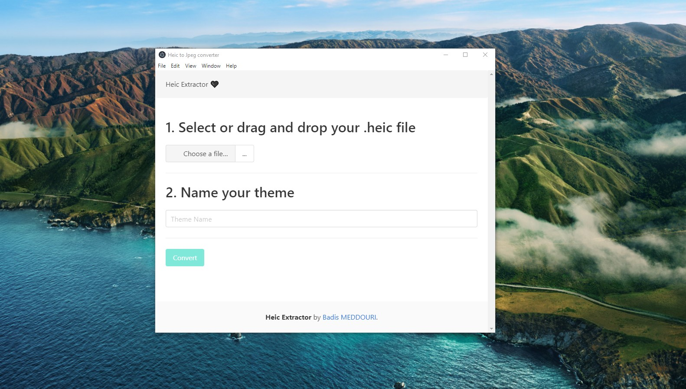
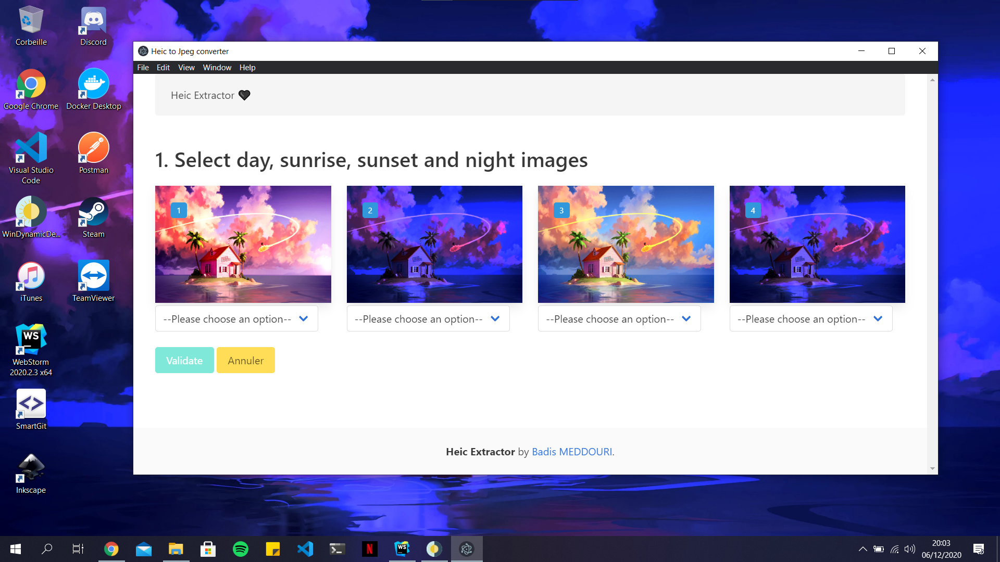

<h2 align="center">Extract Dynamic Heic to JPG</h2>

  

    <a href="https://dynamicwallpaper.club/">Find wallpapers</a>
    ·
    <a href="https://github.com/t1m0thyj/WinDynamicDesktop">WinDynamicDesktop</a>
    ·
    <a href="https://github.com/meddouribadis/extract_heic/issues">Report a bug</a>
  

## About

A small software that converts a Mac OS Dynamic Wallpaper into a dynamic wallpaper for its Windows alternative [WinDynamicDesktop](https://github.com/t1m0thyj/WinDynamicDesktop).

## Usage

1. Just run the software
2. Select or drag and drop your `.heic` file
3. Name your theme for WDD
4. Click on the **Convert** button
5. That's all, open the theme folder and import the `.json` file to WinDynamicDesktop
6. You can edit a theme (images orders) using the **Tweak Theme** button

## Technologies used

- [Electron](https://github.com/electron/electron)
- [Bulma Framework](https://github.com/jgthms/bulma)
- [Heic Convert package](https://github.com/catdad-experiments/heic-convert)

Feel free to contribute